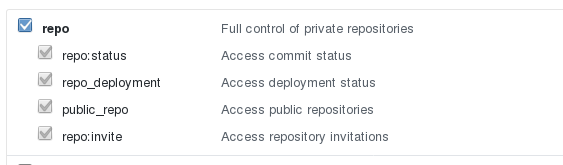

# quick-issues

Quickly view GitHub issues for the currently opened project.

## Use

If you select `Packages` -> `Quick Issues` -> `Issues Dashboard`, then Atom
will fetch the issues connected to the current repo's origin repo,
assuming it's on GitHub. Easy peasy.

Click the "refresh" button to check if any new issues are available, or
use the filter dropdown to limit the issues listed.

## Private repos

`quick-issues` now supports viewing issues attached to private repos.
Full instructions are available in the "Preferences" pane for this package.

### API Token - Permissions
Your API Token needs the following Permissions:

